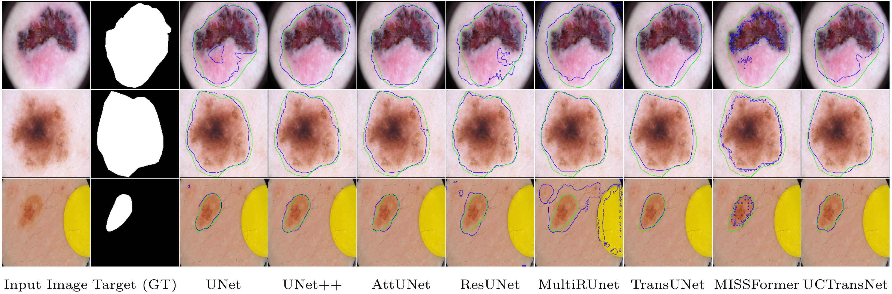
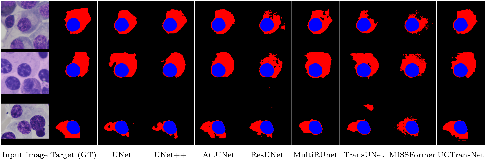
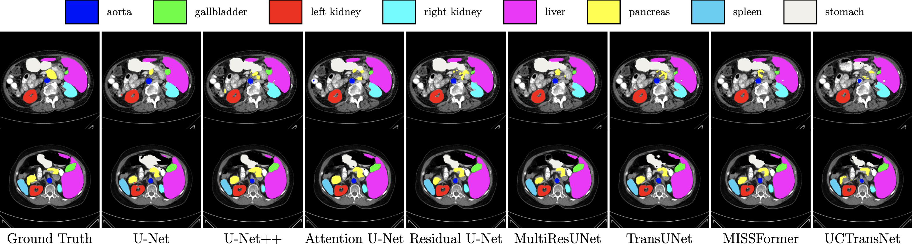

# Awesome U-Net
[](https://github.com/hee9joon/Awesome-Diffusion-Models) 
[](https://opensource.org/licenses/MIT)

Official repo for [Medical Image Segmentation Review: The success of U-Net]()

<p align="center">

</p>

### Announcements
:fire::fire: will be updated soon ...
#### Citation
```latex

```

---
### Abstract
Automatic medical image segmentation is a crucial topic in the medical domain and successively a critical counterpart in the computer-aided diagnosis paradigm. U-Net is the most widespread image segmentation architecture due to its flexibility, optimized modular design, and success in all medical image modalities. Over the years, the U-Net model achieved tremendous attention from academic and industrial researchers. Several extensions of this network have been proposed to address the scale and complexity created by medical tasks. Addressing the deficiency of the naive U-Net model is the foremost step for vendors to utilize the proper U-Net variant model for their business. Having a compendium of different variants in one place makes it easier for builders to identify the relevant research. Also, for ML researchers it will help them understand the challenges of the biological tasks that challenge the model. To address this, we discuss the practical aspects of the U-Net model and suggest a taxonomy to categorize each network variant. Moreover, to measure the performance of these strategies in a clinical application, we propose fair evaluations of some unique and famous designs on well-known datasets. We provide a comprehensive implementation library with trained models for future research. In addition, for ease of future studies, we created an online list of U-Net papers with their possible official implementation.

<p align="center">

</p>


---
## How to use codes (Train and Test)
...


### Pretrained model weights

Here you can download pre-trained weights for networks.

| Network            | SegPC 2021 | ISIC 2018 | *Description*                           |
| ------------------ | ---------- | --------- | --------------------------------------- |
| **U-Net**          |            |           | Without batch normalization; 100 Epochs |
| **Att-UNet**       |            |           |                                         |
| **U-Net++**        |            |           |                                         |
| **MultiResUNet**   |            |           |                                         |
| **Residual U-Net** |            |           |                                         |
| **TransUNet**      |            |           |                                         |
| **UCTransNet**     |            |           |                                         |
| **MISSFormer**     |            |           |                                         |

## Results
For evaluating the performance of some mentioned methods, three challenging tasks in medical image segmentaion has been considered. In bellow, results of them illustrated.

<br>

Performance comparison on ***ISIC 2018*** dataset (best results are bolded).

| Methods            | AC         | PR         | SE         | SP         | Dice       | IoU        |
| ------------------ | ---------- | ---------- | ---------- | ---------- | ---------- | ---------- |
| **U-Net**          | 0.9446     | 0.8746     | 0.8603     | 0.9671     | 0.8674     | 0.8491     |
| **Att-UNet**       | 0.9516     | 0.9075     | 0.8579     | 0.9766     | 0.8820     | 0.8649     |
| **U-Net++**        | 0.9517     | 0.9067     | 0.8590     | 0.9764     | 0.8822     | 0.8651     |
| **MultiResUNet**   | 0.9473     | 0.8765     | 0.8689     | 0.9704     | 0.8694     | 0.8537     |
| **Residual U-Net** | 0.9468     | 0.8753     | 0.8659     | 0.9688     | 0.8689     | 0.8509     |
| **TransUNet**      | 0.9452     | 0.8823     | 0.8578     | 0.9653     | 0.8499     | 0.8365     |
| **UCTransNet**     | **0.9546** | **0.9100** | **0.8704** | **0.9770** | **0.8898** | **0.8729** |
| **MISSFormer**     | 0.9453     | 0.8964     | 0.8371     | 0.9742     | 0.8657     | 0.8484     |

<br>

Performance comparison on ***SegPC 2021*** dataset (best results are bolded).

| Methods            | AC         | PR         | SE         | SP         | Dice       | IoU        |
| ------------------ | ---------- | ---------- | ---------- | ---------- | ---------- | ---------- |
| **U-Net**          | 0.9795     | 0.9084     | 0.8548     | 0.9916     | 0.8808     | 0.8824     |
| **Att-UNet**       | 0.9854     | 0.9360     | 0.8964     | 0.9940     | 0.9158     | 0.9144     |
| **U-Net++**        | 0.9845     | 0.9328     | 0.8887     | 0.9938     | 0.9102     | 0.9092     |
| **MultiResUNet**   | 0.9753     | 0.8391     | 0.8925     | 0.9834     | 0.8649     | 0.8676     |
| **Residual U-Net** | 0.9743     | 0.8920     | 0.8080     | 0.9905     | 0.8479     | 0.8541     |
| **TransUNet**      | 0.9702     | 0.8678     | 0.7831     | 0.9884     | 0.8233     | 0.8338     |
| **UCTransNet**     | **0.9857** | **0.9365** | **0.8991** | **0.9941** | **0.9174** | **0.9159** |
| **MISSFormer**     | 0.9663     | 0.8152     | 0.8014     | 0.9823     | 0.8082     | 0.8209     |

<br>

Performance comparison on ***Synapse*** dataset (best results are bolded).
| Method             | DSC↑      | HD↓       | Aorta     | Gallbladder | Kidney(L) | Kidney(R) | Liver     | Pancreas  | Spleen    | Stomach   |
| ------------------ | --------- | --------- | --------- | ----------- | --------- | --------- | --------- | --------- | --------- | --------- |
| **U-Net**          | 76.85     | 39.70     | 89.07     | 69.72       | 77.77     | 68.60     | 93.43     | 53.98     | 86.67     | 75.58     |
| **Att-UNet**       | 77.77     | 36.02     | **89.55** | **68.88**   | 77.98     | 71.11     | 93.57     | 58.04     | 87.30     | 75.75     |
| **U-Net++**        | 76.91     | 36.93     | 88.19     | 65.89       | 81.76     | 74.27     | 93.01     | 58.20     | 83.44     | 70.52     |
| **MultiResUNet**   | 77.42     | 36.84     | 87.73     | 65.67       | 82.08     | 70.43     | 93.49     | 60.09     | 85.23     | 74.66     |
| **Residual U-Net** | 76.95     | 38.44     | 87.06     | 66.05       | 83.43     | 76.83     | 93.99     | 51.86     | 85.25     | 70.13     |
| **TransUNet**      | 77.48     | 31.69     | 87.23     | 63.13       | 81.87     | 77.02     | 94.08     | 55.86     | 85.08     | 75.62     |
| **UCTransNet**     | 78.23     | 26.75     | 84.25     | 64.65       | 82.35     | 77.65     | 94.36     | 58.18     | 84.74     | 79.66     |
| **MISSFormer**     | **81.96** | **18.20** | 86.99     | 68.65       | **85.21** | **82.00** | **94.41** | **65.67** | **91.92** | **80.81** |


### Visualization

- **Results on ISIC 2018**
  
  
  
  Visual comparisons of different methods on the *ISIC 2018* skin lesion segmentation dataset. Ground truth boundaries are shown in <span style="color: #0F0">green</span>, and predicted boundaries are shown in <span style="color:blue">blue</span>.

- **Result on SegPC 2021**
  
  
  
  Visual comparisons of different methods on the *SegPC 2021* cell segmentation dataset. <span style="color:red">Red</span> region indicates the Cytoplasm and <span style="color:blue">blue</span> denotes the Nucleus area of cell.

- **Result on Synapse**
  
  
  
  Visual comparisons of different methods on the *Synapse* multi-organ segmentation dataset.


## References

### Codes [GitHub Pages]

- AttU-Net: [https://github.com/LeeJunHyun/Image_Segmentation](https://github.com/LeeJunHyun/Image_Segmentation)

- U-Net++: [https://github.com/4uiiurz1/pytorch-nested-unet/blob/master/archs.py](https://github.com/4uiiurz1/pytorch-nested-unet/blob/master/archs.py)

- MultiResUNet: https://github.com/j-sripad/mulitresunet-pytorch/blob/main/multiresunet.py

- Residual U-Net: https://github.com/rishikksh20/ResUnet

- TransUNet: https://github.com/Beckschen/TransUNet

- UCTransNet: https://github.com/McGregorWwww/UCTransNet

- MISSFormer: https://github.com/ZhifangDeng/MISSFormer


### Query
For any query please contact us for more information.
```
rezazad68@gmail.com
ehsan.xxxx@gmail.com
afshinbigboy@gmail.com
```
