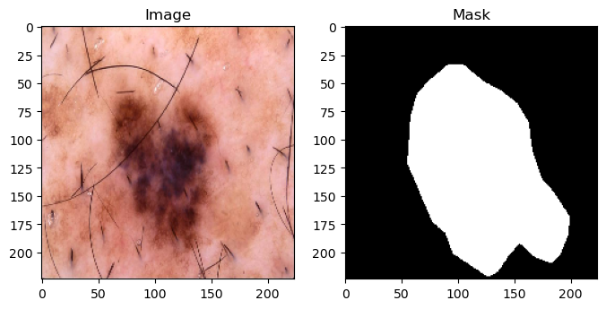
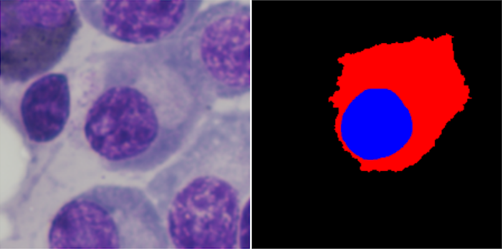

# Data Preparing

The structure of the `datasets` and `configs` folders are here.

```bash
.
├── configs
│   ├── isic
│   │   ├── isic2018_*<net_name>.yaml
│   │   └── ...
│   └── segpc
│       ├── segpc2021_*<net_name>.yaml
│       └── ...
└── datasets
    ├── isic.ipynb
    ├── isic.py
    ├── segpc.ipynb
    ├── segpc.py
    ├── prepare_isic.ipynb
    └── prepare_segpc.ipynb
```

In this work, we used 3 datasets (ISIC, SegPC, and Synapse). In the `datasets` folder, you can see files in 3 different formats,

- `<dataset_name>.py`: These files are used in the main codes for the training and testing procedures.

- `<dataset_name>.ipynb`: These files are just for a better understanding of datasets and how we are using them. You can also see at least one image of the related dataset on them.

- `prepare_<dataset_name>.ipynb`: You can use these files for preparing required files to use desired `Dataset` classes.

When you want to use codes for preparing or using datasets **do not forget to rewrite your right data path** in related dataset files and also corresponding config files.

In the following, you can find more information regarding accessing, preparing, and using datasets.


## ISIC2018 [(ISIC Challenge 2016-2020)](https://challenge.isic-archive.com/)

The lesion images were acquired with a variety of dermatoscopy types, from all anatomic sites (excluding mucosa and nails), from a historical sample of patients presented for skin cancer screening, from several different institutions. Every lesion image contains exactly one primary lesion; other fiducial markers, smaller secondary lesions, or other pigmented regions may be neglected.

#### [Data 2018](https://challenge.isic-archive.com/data/#2018)

You can download the ISIC2018 dataset using the following links,

- [Download training input images](https://isic-challenge-data.s3.amazonaws.com/2018/ISIC2018_Task1-2_Training_Input.zip)

- [Download training ground truth masks](https://isic-challenge-data.s3.amazonaws.com/2018/ISIC2018_Task1_Training_GroundTruth.zip)

After downloading, extract them in a folder, and ***do not forget to put the path*** on relevant files. 

The input data are dermoscopic lesion images in JPEG format.

All lesion images are named using the scheme `ISIC_<image_id>.jpg`, where `<image_id>` is a 7-digit unique identifier. EXIF tags in the images have been removed; any remaining EXIF tags should not be relied upon to provide accurate metadata.

At bellow, you can see a sample of this dataset.

<p align="center">

</p>


## SegPC2021 [(SegPC Challenge 2021)](https://ieee-dataport.org/open-access/segpc-2021-segmentation-multiple-myeloma-plasma-cells-microscopic-images)

This [challenge](https://segpc-2021.grand-challenge.org/) was positioned towards robust segmentation of cells which is the first stage to build such a tool for plasma cell cancer, namely, Multiple Myeloma (MM), which is a type of blood cancer. They provided images after stain color normalization.

In this challenge, the target was instance segmentation of cells of interest. For each input image, both nuclei and cytoplasm were required to be segmented separately for each cell of interest.

### Our purpose

In this work, we used this dataset for a bit different purpose. Here, we want to use the SegPC2021 database to create an independent image centered on the nucleus for each desired cell in this dataset, with the ultimate goal of obtaining the cytoplasm of that cell. Also, the nucleus mask will be used as an auxiliary channel in the input images. You can refer to [this article](https://arxiv.org/abs/2105.06238) for more information. You can download the main dataset using the following links:

- [Official page](https://ieee-dataport.org/open-access/segpc-2021-segmentation-multiple-myeloma-plasma-cells-microscopic-images)
- [Alternative link](https://www.kaggle.com/datasets/sbilab/segpc2021dataset)

After downloading the dataset you can use the `prepare_segpc.ipynb` file to produce the required data file. ***Do not forget to put the right path on relevant files***.

Below, you can see a sample of the prepared dataset with `scale=2.5`.

<p align="center">

</p>


## Synapse

1. Access to the synapse multi-organ dataset:
   
   1. Sign up in the [official Synapse website](https://www.synapse.org/#!Synapse:syn3193805/wiki/) and download the dataset. Convert them to numpy format, clip the images within [-125, 275], normalize each 3D image to [0, 1], and extract 2D slices from 3D volume for training cases while keeping the 3D volume in h5 format for testing cases.
   
2. The directory structure of the whole project is as follows:
   
   ```bash
   .
   ├── model
   │   └── vit_checkpoint
   │       └── imagenet21k
   │           ├── R50+ViT-B_16.npz
   │           └── *.npz
   └── data
       └──Synapse
           ├── test_vol_h5
           │   ├── case0001.npy.h5
           │   └── *.npy.h5
           └── train_npz
           ├── case0005_slice000.npz
           └── *.npz
   ```
